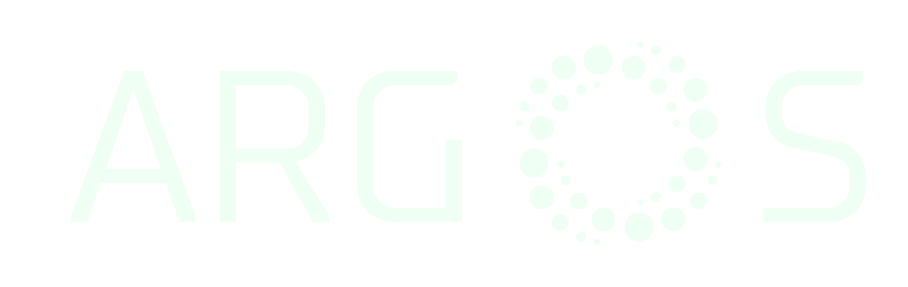

# `arpa` - a package for pulsar science in ARGOS

Keeps track of TOAs and related things. This is mostly based off of TOASTER by Patrick Lazarus.

Most informations are split into data and metadata, e.g. `toa` and `toa_meta`. Parfiles and raw files are kept as files somewhere, and so only metadata is put in the DB.

## Changelog
### 0.3.0
 - Prepared as library.
